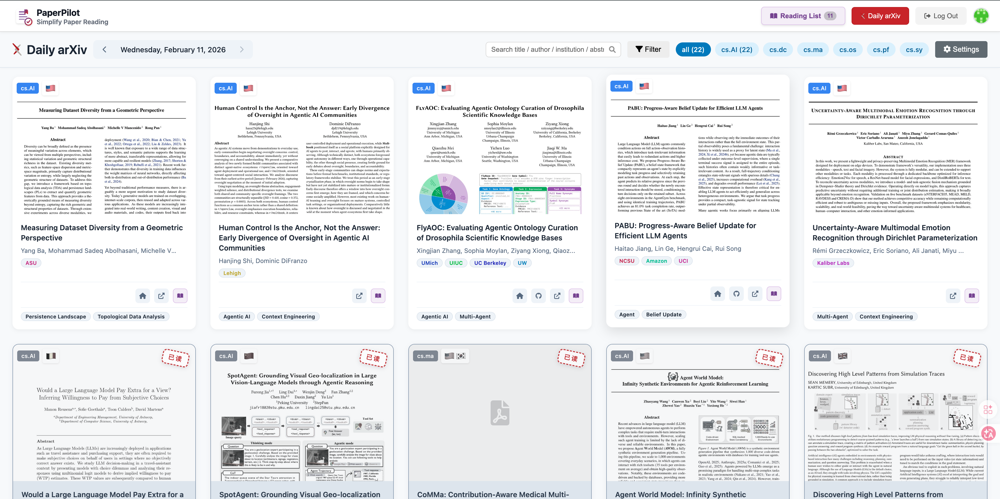
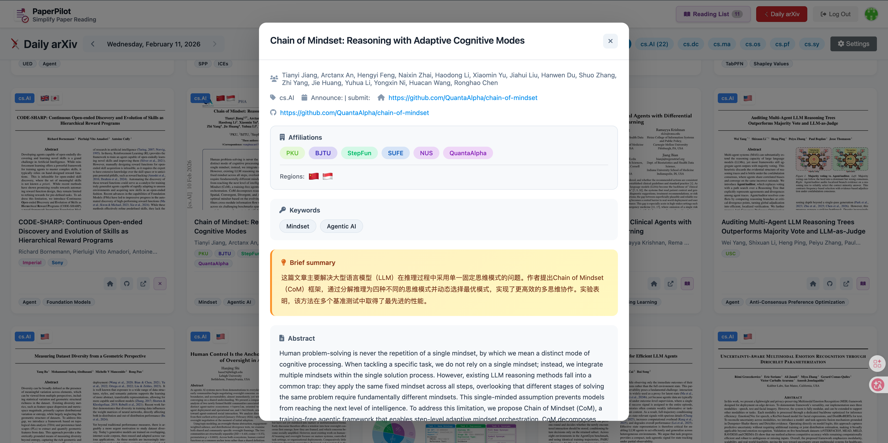
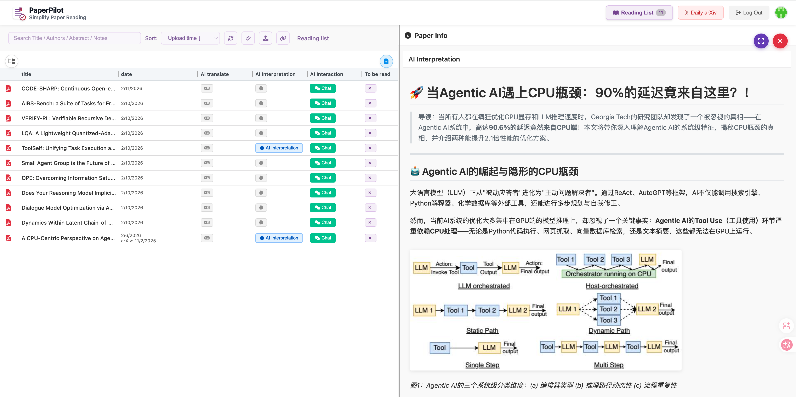
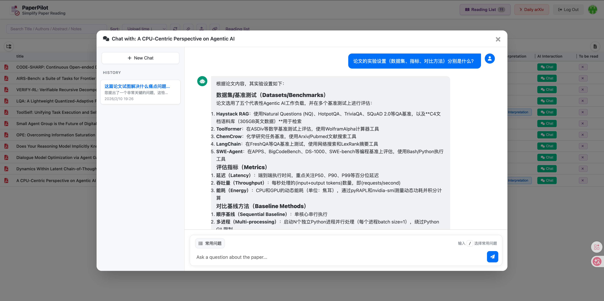
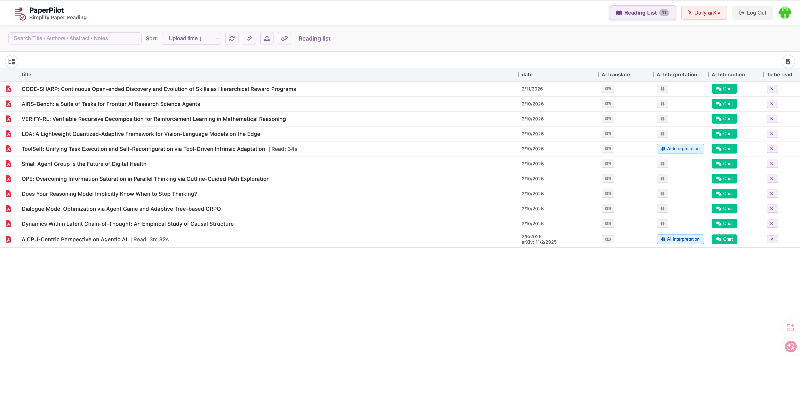
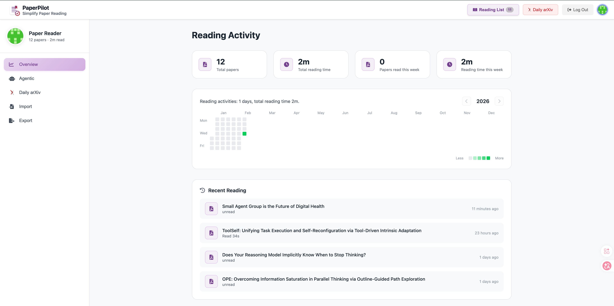
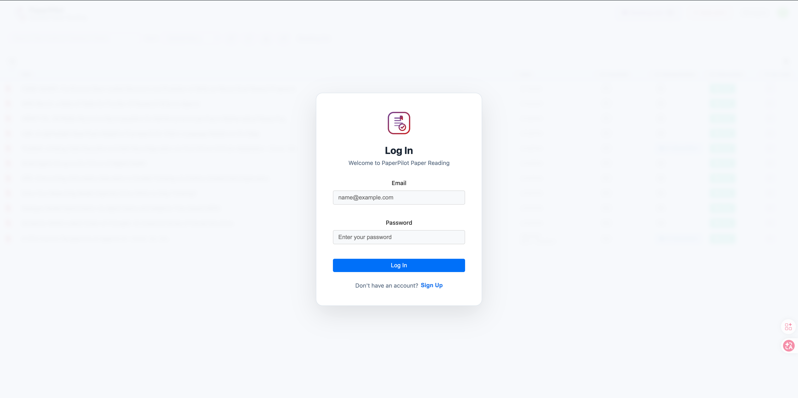

# PaperPilot

<div align="center">


**A Fully Open-Source, AI-Native Paper Reading & Management Platform**

[](https://creativecommons.org/licenses/by-nc/4.0/)
[](https://www.python.org/downloads/)
[]()

[English](README.md) | [中文](README_zh.md)

</div>

---

> This project is developed based on the open-source project [Resophy](https://github.com/Mountchicken/Resophy). Special thanks to the original author for their interesting creation.

## 📖 Introduction

<div align="center">
  <video src="static/videos/PaperPilot-demo.mp4" controls width="100%"></video>
</div>

**PaperPilot** is a next-generation research assistant designed to streamline your academic workflow. By integrating advanced AI capabilities with a robust document management system, PaperPilot helps you discover, read, understand, and manage research papers more efficiently than ever before.

Whether you are tracking the latest ArXiv preprints or deep-diving into complex PDFs, PaperPilot acts as your intelligent co-pilot.

> **Note**: This project was built using **Trae Coding Agent** via **Vibe Coding**, leveraging two models (**Gemini-3-Pro-Preview** for feature development and **GPT-5.2** for bug fixes and performance optimization). It is truly incredible for someone like me who hasn't written modern Web frontend code 🤯 (the last time I wrote Web code was manually coding HTML and CSS during my undergraduate years).

## ✨ Key Features

### 📚 Smart Paper Management
- **Seamless Upload**: Drag & drop PDF uploads with automatic metadata extraction.
- **Organization**: Custom categories, folders, and full-text search.
- **Zotero Integration**: One-click import from Zotero RDF libraries.
- **Reading Heatmap**: Visualize your reading habits with a GitHub-style contribution graph.

### 🤖 AI-Powered Reading Assistant
- **AI Translation**: Generate pixel-perfect English-to-Chinese (and other languages) translations using **BabelDOC**, preserving original layout and charts.
- **AI Interpretation**: Deep analysis of papers using **MinerU** (PDF-to-Markdown) and LLMs to generate structured summaries (Abstract, Methods, Experiments, Conclusions).
- **Chat with Paper**: Interactive Q&A with your documents to clarify concepts and details.

### 📡 Daily ArXiv Radar
- **Automated Tracking**: Schedule daily fetches from specific ArXiv categories (e.g., `cs.CV`, `cs.AI`).
- **Smart Filtering**: Filter papers by keywords, institution weights, and more.
- **AI Summarization**: Automatically generate concise summaries for new arrivals.
- **Offline Capable**: Works even without LLM connections (skips summary/institution details).

## 📸 Feature Showcase

### 📡 Daily ArXiv Tracking
Automated daily paper fetching with AI summaries to keep you updated.
<div align="center">
  
  
</div>

### 🤖 AI Interpretation & Chat
Deep full-text analysis and interactive Q&A to bridge language and understanding gaps.
<div align="center">
  
  
</div>

### 📚 Management & Configuration
Efficient reading list management and flexible system configuration.
<div align="center">
  
  
</div>

### 🔐 Secure Authentication & Access Control
Supports user authentication for secure private access and public network deployment.
<div align="center">
  
</div>

## 🛠️ Tech Stack

- **Backend**: Python 3.10+, Flask
- **Frontend**: HTML5, CSS3, Vanilla JS (Responsive)
- **Database**: SQLite (Metadata), Supabase (Optional Auth)
- **AI Core**:
  - [MinerU](https://github.com/opendatalab/MinerU) (High-fidelity PDF parsing)
  - [BabelDOC](https://github.com/funstory-ai/BabelDOC) (Document Translation)
  - OpenAI-compatible LLM Interface

## 🚀 Installation

We recommend using [uv](https://github.com/astral-sh/uv) for fast and reliable dependency management.

### Prerequisites
- Python 3.10 or higher
- `uv` package manager

### Steps

1. **Clone the Repository**
   ```bash
   git clone https://github.com/flyflypeng/PaperPilot
   cd PaperPilot
   ```

2. **Initialize Environment**
   ```bash
   uv venv
   source .venv/bin/activate  # Linux/macOS
   # .venv\Scripts\activate   # Windows
   ```

3. **Install Dependencies**
   
   **Option A: Standard (Client-only)**
   Suitable if you use external APIs for AI tasks.
   ```bash
   uv pip install -e ".[local]"
   ```

   **Option B: Full Server (Local AI)**
   Includes dependencies for local MinerU and VLM inference.
   ```bash
   uv pip install -e ".[server]"
   ```

4. **Supabase Auth (Optional)**
   PaperPilot’s login/sign-up is powered by Supabase Auth (Email + Password). When enabled, the frontend uses `supabase-js` in the browser to obtain a session token and attaches `Authorization: Bearer <access_token>` to `/api/*` requests; the backend validates the token via Supabase `/auth/v1/user`.
   If `SUPABASE_URL` and `SUPABASE_ANON_KEY` are not configured, auth is disabled by default: the login overlay is hidden, and `/api/*` endpoints do not require an `Authorization` header, so you can enter the management UI directly.

   1) Create a Supabase project and get API values
   - Create a project at https://supabase.com/
   - In the Supabase dashboard, open **Project Settings → API**
   - Copy **Project URL** as `SUPABASE_URL`
   - Copy **Project API keys → anon public** as `SUPABASE_ANON_KEY`

   2) Enable Email auth
   - Go to **Authentication → Providers**
   - Enable **Email** (Email/Password)
   - For local/private deployments, you can disable email confirmations in **Authentication → Settings** to avoid requiring email verification after sign-up

   3) Configure redirect URLs (important)
   - Go to **Authentication → URL Configuration**
   - Set **Site URL** to your site origin, for example:
   - Local: `http://localhost:7191`
   - Production: `https://your-domain.com`
   - Add allowed callback URLs in **Redirect URLs** (at least include your site root), for example:
   - `http://localhost:7191/`
   - `https://your-domain.com/`

   4) Enable auth in PaperPilot
   Copy and edit environment variables in the project root:
   ```bash
   cp .env.example .env
   # Edit .env and fill in SUPABASE_URL and SUPABASE_ANON_KEY
   ```
   Restart the server. If configured correctly, you will see the login/sign-up entry on the page.

   **Security notes**
   - Use only the `anon public` key; never put `service_role` keys into `.env` or ship them to the browser
   - This project injects `SUPABASE_URL` and `SUPABASE_ANON_KEY` into pages for browser-side login, which is expected


5. **Run the Application**

   Then start the application:
   ```bash
   python app.py
   ```
   Access the web interface at `http://localhost:7191` (default port).

   **Custom Launch Arguments:**
   `app.py` supports the following command-line arguments for custom configuration:

   | Argument | Default | Description |
   | :--- | :--- | :--- |
   | `--papers-dir` | `./papers` | Path to the papers directory (absolute or relative) |
   | `--host` | `0.0.0.0` | Server listening address |
   | `--port` | `7191` | Server listening port |
   | `--debug` | `False` | Enable debug mode (for development) |

   **Typical Configuration Examples:**

   - **Specify Data Storage Location** (useful for mounted data volumes):
     ```bash
     python app.py --papers-dir /mnt/data/my_papers
     ```

   - **Change Server Port** (if the default port is occupied):
     ```bash
     python app.py --port 8080
     ```

   - **Allow Local Access Only** (for enhanced security):
     ```bash
     python app.py --host 127.0.0.1
     ```

## ⚙️ Configuration

PaperPilot is designed to be configurable directly from the Web UI.

### Agentic Settings
Navigate to the **Settings** tab to configure:
- **LLM Provider**: Set your API Key, Base URL, and Model Name (e.g., GPT-4, Qwen, DeepSeek).
- **MinerU**: Choose between Local instance or Cloud API.

### Daily ArXiv
Configure your research interests:
- **Categories**: Select ArXiv categories to monitor.
- **Keywords**: Define keywords for filtering and highlighting.
- **Schedule**: Set the automatic fetch interval.

## ⚠️ Important Notes

- **Multi-User Support**: The current version of PaperPilot is designed for individuals or small teams and does not yet fully support multi-tenancy. While it supports authentication via Supabase, all users share the same backend configuration and paper library. It is recommended to deploy in a private network or trusted environment.
- **BabelDOC Translation**: The English-Chinese parallel translation feature based on BabelDOC has high memory consumption and a long processing time. It is recommended to use this feature primarily for papers that require intensive reading.

## 🗺️ Roadmap

> Contributions are welcome! This roadmap is a living document and will evolve with user needs and available time.

### Near-Term (Next)
- [ ] Reading annotations: highlights, comments, bookmarks, and one-click quote snippets
- [ ] Paper chat improvements: grounded answers with page/paragraph/snippet references
- [ ] Daily ArXiv rules upgrade: keyword combinations, exclusions, regex
- [ ] Deployment & ops: Docker Compose, automated backup/restore, health checks

### Mid-Term (Mid)
- [ ] Semantic search: local embeddings index (optional vector store) with cross-library search
- [ ] Personal knowledge base: turn notes/summaries into a queryable research log (topics/timeline)
- [ ] Job queue & progress center: unified queue for translation/interpretation/indexing with retries and priorities

### Long-Term (Future)
- [ ] Multi-tenancy: isolate libraries and settings per user/team
- [ ] Paper recommendations & graph: citation-network and reading-behavior signals
- [ ] Collaborative workspace: shared folders, team annotations, access control
- [ ] Multimodal understanding: structured extraction for figures/equations/tables and searchability
- [ ] Mobile/PWA: offline reading and cross-device sync

### Performance & UX (Ongoing)
- [ ] Faster PDF rendering, page cache, and on-demand loading for long documents
- [ ] Incremental indexing for global search (avoid full rescans)
- [ ] Configuration validation and one-click diagnostics (LLM/MinerU/BabelDOC)
- [ ] Observability: job timings, failure reasons, and basic metrics


## 📄 License

This project is licensed under the **CC BY-NC 4.0** License. See the [LICENSE](LICENSE) file for details.

---
<div align="center">
Made with ❤️ by the PaperPilot Team
</div>
